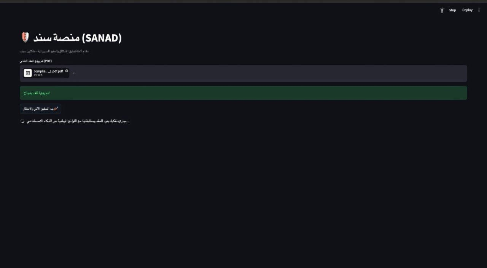
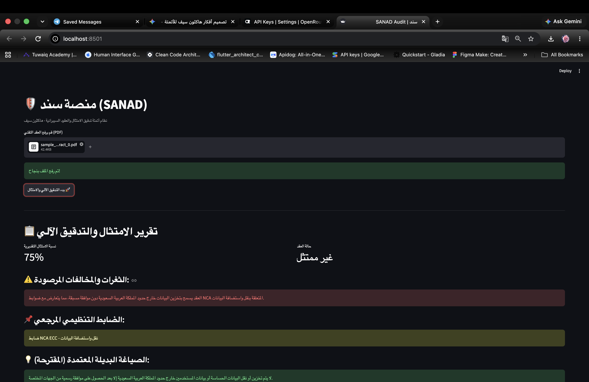
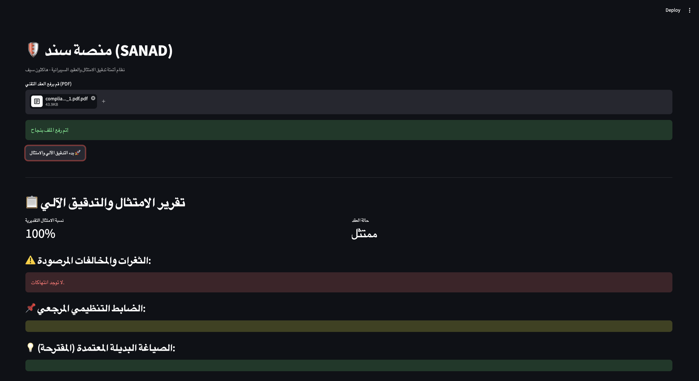

# 🛡️ منصة سَنَد (SANAD Audit)

> **نموذج أولي (MVP) مُطوّر خلال مشاركته في هاكثون سيف التقني**

منصة ذكية قائمة على الذكاء الاصطناعي لتشغيل وتدقيق الامتثال للوائح الوطنية (ضوابط الأمن السيبراني الأساسية **NCA ECC** ونظام حماية البيانات الشخصية **PDPL**) في العقود والاتفاقيات التقنية بشكل آلي.

---

## 🎯 الفكرة والمشكلة

تعاني الجهات من استغراق أسابيع في تدقيق العقود التقنية يدوياً للتأكد من مطابقتها للأنظمة الوطنية. تقدم **سَنَد** حلاً فورياً يستخرج الثغرات والمخالفات القانونية والسيبرانية في ثوانٍ مع تقديم الصياغة المعتمدة البديلة.

---

## ✨ المميزات الرئيسية

* 📄 **تحليل العقود (PDF):** رفع المستندات واستخراج النصوص تلقائياً.
* 🔎 **مطابقة تنظيمية دقيقة (RAG):** البحث في قاعدة معرفية محلية تحتوي على لوائح NCA و PDPL.
* 📊 **تقييم الامتثال:** عرض حالة العقد (ممتثل / غير ممتثل) وحساب نسبة امتثال تقديرية.
* 💡 **توصيات وصياغة بديلة:** توضيح المادة المخالفة واقتراح الصياغة القانونية الممتثلة.

---

## 🏗️ المعمارية والتقنيات (Architecture & Tech Stack)

تم بناء المشروع باتباع الهيكلية النظيفة (**Clean Architecture**) لضمان قابلية التوسع والفصل بين المكونات:

* **Presentation Layer:** Streamlit (واجهة تفاعلية خفيفة وسريعة)
* **Domain Layer:** Entities & Core Audit Logic (منطق العمل ومطابقة الامتثال)
* **Data Layer:** 
  * **Vector Store:** ChromaDB (قاعدة بيانات متجهة محلية)
  * **Embeddings:** HuggingFace (`paraphrase-multilingual-MiniLM-L12-v2`)
  * **LLM Orchestration:** LangChain & OpenRouter API (`openai/gpt-4o-mini`)

---

## 📸 لقطات الشاشة والواجهة (Screenshots)

## 🟡 loading تحميل

---

### 🔴 فحص عقد غير ممتثل (رصد المخالفات والصياغة البديلة):

---

### 🟢 فحص عقد ممتثل (نسبة امتثال عالية):

---

## 🚀 طريقة التشغيل المحلي (Getting Started)

### 1. استكشاف المشروع وتفعيل البيئة الافتراضية
```bash
git clone <repository-url>
cd SANAD_PROJECT
python3 -m venv venv
source venv/bin/activate
pip install -r requirements.txt